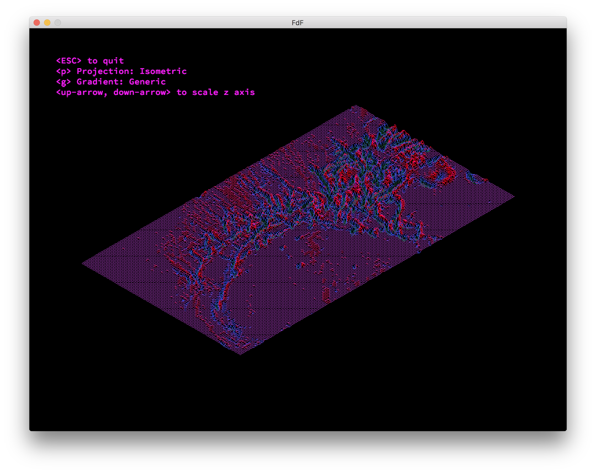

# 42-FdF

Isometric wireframe landscape viewer.

Getting Started
---------------
1. Clone the repo and fetch submodules  
  `git clone --recurse-submodules https://github.com/joshmocniak/42-FdF.git`  
  `cd 42-FdF`  
2. Compile    
  `make`   
3. Run FdF  
  `./fdf test_maps/pyramide.fdf`  

Usage
-----

`./fdf <map>`  

| Controls |  |
| :- | :- |
| ESC | Exit program |
| p | Change projection |
| g | Change gradient |
| UP, DOWN | Scale z-axis |

Various maps are found in the test_maps directory.  You can also make your own by creating a text file formatted as described below.

#### Example Map (test_maps/42.fdf)
<pre>
0  0  0  0  0  0  0  0  0  0  0  0  0  0  0  0  0  0  0
0  0  0  0  0  0  0  0  0  0  0  0  0  0  0  0  0  0  0
0  0 10 10  0  0 10 10  0  0  0 10 10 10 10 10  0  0  0
0  0 10 10  0  0 10 10  0  0  0  0  0  0  0 10 10  0  0
0  0 10 10  0  0 10 10  0  0  0  0  0  0  0 10 10  0  0
0  0 10 10 10 10 10 10  0  0  0  0 10 10 10 10  0  0  0
0  0  0 10 10 10 10 10  0  0  0 10 10  0  0  0  0  0  0
0  0  0  0  0  0 10 10  0  0  0 10 10  0  0  0  0  0  0
0  0  0  0  0  0 10 10  0  0  0 10 10 10 10 10 10  0  0
0  0  0  0  0  0  0  0  0  0  0  0  0  0  0  0  0  0  0
0  0  0  0  0  0  0  0  0  0  0  0  0  0  0  0  0  0  0
</pre>

Map files are text files containing rows of space delimeted numbers.  The numbers represent the altitude (z-axis) of points in an evenly spaced grid.  Horizontal position of the number corresponds to abscissa (x).  Vertical position of the number corresponds to ordinate (y).
  
A number can optionally be followed by ",0x" and up to 6 hex characters to specify color at the coordinate.  
i.e. `20,0xFF0000` represents a coordinate with an altitude of 20 that is red.

